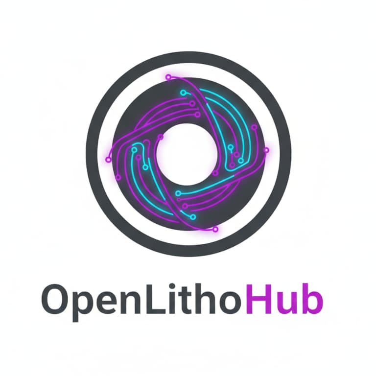

<p align="center">
  
</p>

# OpenLithoHub

> ⭐ **If you find this project helpful, please drop us a star!** It helps us get discovered by the community and is by far the most useful thing you can do for an early-stage open-source project.

**Open-source computational lithography benchmarking and workflow toolkit for advanced EUV/curvilinear mask processes.**

[](https://pypi.org/project/openlithohub/)
[](LICENSE)
[](https://www.python.org/)
[](https://github.com/OpenLithoHub/OpenLithoHub/actions)
[](https://colab.research.google.com/github/OpenLithoHub/OpenLithoHub/blob/main/notebooks/colab_byom.ipynb)

> **Website:** [openlithohub.com](https://openlithohub.com) | **Docs:** [docs.openlithohub.com](https://docs.openlithohub.com) | **Playground:** [HuggingFace Space](https://huggingface.co/spaces/OpenLithoHub/playground)

[中文版 / Chinese Version](docs/README_zh.md)

---

## What is OpenLithoHub?

OpenLithoHub provides a unified evaluation and workflow framework for computational lithography research. It bridges the gap between academic tensor-based optimization and industrial mask manufacturing by offering:

- **Unified dataset access** — single interface to LithoBench, LithoSim, GAN-OPC, ICCAD'16 hotspot, ASAP7, FreePDK45 + NanGate OCL, and ORFS-routed RISC-V layouts
- **Standardized metrics** — EPE, PV Band, shot count, EUV stochastic robustness, hotspot detection (recall / precision / F1)
- **Manufacturing compliance** — MRC/DRC rule checking as hard-fail gating
- **OASIS workflow** — end-to-end pipeline from tensor to fab-ready mask (manhattan & curvilinear)
- **Model-agnostic evaluation** — plug any OPC/ILT model into the benchmark via a minimal interface
- **JIT-accelerated forward model** — Hopkins/SOCS forward is wrapped with `torch.compile` by default, for free kernel-fusion speedups on PyTorch 2.x (use `--no-compile` to disable)

```text
┌─────────────────────────────────────────────────────────────────┐
│                       OpenLithoHub                              │
├─────────────┬──────────────┬──────────────┬───────────┬─────────┤
│  Data Layer │  Benchmark   │   Workflow   │ Vis & UX  │   CLI   │
│ LithoBench  │  EPE/PVBand  │ Tiling/Stitch│ Paper figs│ eval    │
│ LithoSim    │  MRC/DRC     │ Contour Ext. │ Jupyter   │ optimize│
│ Transforms  │  Stochastic  │ OASIS Export │ EDA bridge│leaderbd │
│ Dummy gen.  │  Shot Count  │ B-spline Fit │           │         │
└─────────────┴──────────────┴──────────────┴───────────┴─────────┘
```

---

## Installation

> OpenLithoHub is currently in **alpha** (`0.1.0a2` on PyPI). Until a
> stable `0.1.0` is cut, install with `--pre` so pip does not skip
> pre-releases.

```bash
# Core (metrics + CLI)
pip install --pre openlithohub

# With dataset support (HuggingFace, parquet)
pip install --pre 'openlithohub[data]'

# With full workflow (KLayout, scipy for B-spline)
pip install --pre 'openlithohub[workflow]'

# Everything
pip install --pre 'openlithohub[all]'
```

**From source (development):**

```bash
git clone https://github.com/OpenLithoHub/OpenLithoHub.git
cd OpenLithoHub
pip install -e ".[dev]"
```

---

## Quick Start

### Evaluate a model

```bash
openlithohub eval run \
  --model dummy-identity \
  --dataset lithobench \
  --data-root ./data/lithobench \
  --format table
```

Output:
```
┌──────────────────┬────────────────┐
│ Metric           │ Value          │
├──────────────────┼────────────────┤
│ epe_mean_nm      │ 0.0000         │
│ epe_max_nm       │ 0.0000         │
│ mrc_violation_rate│ 0.0000        │
│ mrc_passed       │ 1.0000         │
└──────────────────┴────────────────┘
```

### Run end-to-end optimization

```bash
openlithohub optimize run \
  --input design.oas \
  --model your-model \
  --writer mbmw \
  --node 3nm-euv \
  --drc-check \
  --output optimized.oas
```

### Use as a Python library

```python
import torch
from openlithohub.benchmark.metrics import compute_epe, compute_pvband
from openlithohub.benchmark.compliance import check_mrc, check_drc

predicted = torch.load("predicted_mask.pt")
target = torch.load("target_mask.pt")

# Edge Placement Error
epe = compute_epe(predicted, target, pixel_size_nm=1.0)
print(f"EPE mean: {epe['epe_mean_nm']:.2f} nm")

# Process Variation Band
pvb = compute_pvband(predicted, defocus_range_nm=20.0)
print(f"PV Band: {pvb['pvband_mean_nm']:.2f} nm")

# Manufacturing compliance
mrc = check_mrc(predicted, min_width_nm=40.0, min_spacing_nm=40.0)
print(f"MRC passed: {mrc.passed} ({mrc.violation_count} violations)")
```

### Register a custom model

```python
from openlithohub.models.base import LithographyModel, PredictionResult
from openlithohub.models.registry import registry

@registry.register
class MyOPCModel(LithographyModel):
    @property
    def name(self) -> str:
        return "my-opc"

    @property
    def supports_curvilinear(self) -> bool:
        return True

    def predict(self, design: torch.Tensor, **kwargs) -> PredictionResult:
        mask = my_optimization_algorithm(design)
        return PredictionResult(mask=mask)
```

### Paper-ready figures

```python
from openlithohub.vis import plot_contours

# Vector PDF, IEEE column-width, colorblind-safe palette
plot_contours(target, predicted, save_path="fig.pdf", style="ieee")
```

### Hermetic dummy layouts (for CI / Colab)

```python
from openlithohub.data import generate_dummy_layout

mask = generate_dummy_layout(size=256, seed=0)  # numpy + torch only, no KLayout
```

### EDA bridge (Calibre / IC Validator)

```python
from openlithohub.workflow import BridgeRules, emit_bridge_bundle

emit_bridge_bundle(
    "optimized.oas",
    BridgeRules(min_width_nm=40.0, min_spacing_nm=40.0),
)
# Writes optimized.svrf, optimized.rs, optimized.bridge.md
```

### Try it in Colab

The `notebooks/quickstart.ipynb` tutorial runs end-to-end on Colab's stock
runtime — install, generate a layout, score it, and produce a paper-ready
figure in three minutes.

[](https://colab.research.google.com/github/OpenLithoHub/OpenLithoHub/blob/main/notebooks/quickstart.ipynb)

For plugging your own model into the harness, use the BYOM tutorial — it
walks through subclassing `LithographyModel`, running the standard metric
suite, and formatting a leaderboard submission.

[](https://colab.research.google.com/github/OpenLithoHub/OpenLithoHub/blob/main/notebooks/colab_byom.ipynb)

---

## Architecture

| Layer | Module | Description |
|-------|--------|-------------|
| **Data** | `openlithohub.data` | Unified adapters for LithoBench (.npy), LithoSim (HuggingFace), GAN-OPC (paired PNGs), ICCAD'16 hotspot (OASIS via klayout) |
| **Benchmark** | `openlithohub.benchmark` | EPE, PV Band, shot count, stochastic robustness, hotspot detection, MRC/DRC compliance |
| **Models** | `openlithohub.models` | Abstract `LithographyModel` interface + decorator-based registry |
| **Workflow** | `openlithohub.workflow` | Layout parsing, tiling, contour extraction (manhattan/curvilinear), OASIS export |
| **CLI** | `openlithohub.cli` | `eval`, `optimize`, and `leaderboard` command groups via Typer |

---

## Metrics

| Metric | Description | Reference |
|--------|-------------|-----------|
| **EPE** | Edge Placement Error — distance between predicted and target contour edges | Standard |
| **PV Band** | Process Variation Band — resist contour variation across dose/focus window | Standard |
| **Shot Count** | Mask write time proxy for MBMW and VSB writers | Industry |
| **Stochastic Robustness** | Monte Carlo photon noise simulation for bridge/break probability | EUV-specific |
| **MRC** | Minimum width/spacing rule check (hard-fail) | EasyMRC |
| **Curvilinear MRC** | Minimum curvature radius + minimum feature area for post-ILT curvilinear shapes (MBMW writability) | EUV-specific |
| **DRC** | Design Rule Check: area, notch, width, spacing | OpenDRC |

---

## Supported Datasets

| Dataset | Format | Process Node | Task | Source |
|---------|--------|--------------|------|--------|
| **LithoBench** | NumPy .npy | 45nm | Mask optimization | NeurIPS'23 |
| **LithoSim** | HuggingFace Parquet | Sub-28nm | Mask optimization | NeurIPS'25 |
| **GAN-OPC** | Paired PNGs | — | AI-OPC training | TCAD'20 |
| **ICCAD'16 Problem C** | OASIS + CSV | N7 EUV | Hotspot detection | ICCAD'16 |
| **ASAP7 standard cells** | GDSII (klayout) | 7nm predictive | PDK-aware OPC | The-OpenROAD-Project/asap7 |
| **FreePDK45 + NanGate OCL** | GDSII (klayout) | 45nm predictive | PDK-aware OPC | mflowgen/freepdk-45nm |
| **ORFS-routed ASAP7** | GDSII (klayout) | 7nm | RISC-V tile-cut hotspots | OpenROAD-flow-scripts |

---

## Baselines

Reference numbers for the bundled models on eight synthetic 64×64 layouts
(square, line, line/space, T, L, cross, contacts, dense lines). These are
generated end-to-end by `scripts/generate_baselines.py` and persisted under
`baselines/`. See [`docs/benchmarks.md`](docs/benchmarks.md) for the
methodology, the Hopkins forward model, and reproduction instructions.

| Model | EPE mean (nm) | EPE max (nm) | PVB mean (nm) | MRC pass |
|---|---|---|---|---|
| `dummy-identity` | 0.000 | 0.000 | 2.140 | 0% |
| `rule-based-opc` (analytic OPC bias) | 0.530 | 1.414 | 2.487 | 0% |
| `levelset-ilt` (Gaussian PSF, 200 iters) | 0.036 | 0.250 | 2.128 | 0% |
| `neural-ilt` (untrained U-Net) | 15.074 | 24.637 | 2.497 | 100% |

See [`baselines/results.md`](baselines/results.md) for per-pattern breakdowns.

Reproduce locally:

```bash
python scripts/generate_baselines.py --synthetic --limit 8 --output baselines/
```

---

## Optical forward models

OpenLithoHub ships two differentiable forward models, both written in pure
PyTorch so the entire ILT loop is end-to-end auto-differentiable:

| Model | Module | Notes |
|---|---|---|
| Gaussian PSF | `openlithohub._utils.forward_model.simulate_aerial_image` | Single-Gaussian convolution; cheap default for tests and small grids |
| Hopkins SOCS | `openlithohub._utils.simulate_aerial_image_hopkins` | Partial-coherent imaging via SVD-truncated Sum-Of-Coherent-Systems; supports circular / annular / dipole illumination |

Switch `LevelSetILTModel` to Hopkins:

```python
from openlithohub._utils import HopkinsParams
from openlithohub.models.levelset_ilt import LevelSetILTModel

model = LevelSetILTModel(
    iterations=200,
    forward_model="hopkins",
    hopkins_params=HopkinsParams(
        wavelength_nm=193.0, na=1.35, sigma=0.7, num_kernels=24, pixel_size_nm=2.0,
    ),
)
```

---

## Development

```bash
# Run tests
pytest tests/ -v

# Lint
ruff check src/ tests/

# Type check
mypy src/

# Format
ruff format src/ tests/
```

---

## Roadmap

- [x] Milestone 1: Unified data adapters, EPE metric, `eval` CLI
- [x] Milestone 2: MRC compliance, Manhattan contour extraction, tiling, shot count
- [x] Milestone 3: OASIS workflow, PV Band, stochastic robustness, DRC, B-spline fitting, `optimize` CLI
- [x] Milestone 4: Public leaderboard, MkDocs documentation site, CI/CD for docs
- [x] Milestone 5: Web playground (HuggingFace Spaces)
- [x] Milestone 6: Real ILT models (LevelSet-ILT, Neural-ILT U-Net), DTCO process nodes, resist simulation, model hub, Jupyter integration, PyPI/Docker CI/CD
- [x] Milestone 7: Paper-ready visualization, dummy layout generator, EDA bridge templates, Colab quickstart
- [x] Milestone 8: Multi-stage KLayout Docker, AI-engineer terminology guide, Auto-Leaderboard CI, community charter (Discord), v0.1 launch announcement
- [x] Milestone 9: PDK-aware synthetic layout generator, vendor-neutral simulator hook API, EUV 3D-mask shadow proxy, Monte Carlo failure metric, Mini-Hackathon (2026-Q3), RFC 0001 (Layout-MAE) + RFC 0002 (Layout Tokens)
- [x] Milestone 10: Real PDK rollout — ASAP7 standard cells, FreePDK45 + NanGate OCL, ORFS-routed RISC-V mock-alu (issue [#4](https://github.com/OpenLithoHub/OpenLithoHub/issues/4))

---

## Related Projects

| Project | Venue | Role in Ecosystem |
|---------|-------|-------------------|
| LithoSim | NeurIPS'25 | Sub-28nm industrial dataset |
| LithoBench | NeurIPS'23 | 45nm evaluation framework |
| TorchLitho 2.0 | ASICON'25 | Differentiable lithography simulator |
| [curvyILT](https://github.com/phdyang007/curvyILT) | NVIDIA arXiv'24 | GPU-accelerated curvilinear ILT |
| EasyMRC | TODAES'25 | MRC reference implementation |

---

## Contributing

See [CONTRIBUTING.md](CONTRIBUTING.md) for guidelines.

---

## Community


A **Discord** server for OpenLithoHub is launching **2026-Q3** — channels
for model discussion, physics simulation, help, and showcase. The place
to debate model design, reproducibility, and benchmarks.

Want to be notified when the invite goes live? **[Open an issue with the
`community` label](https://github.com/OpenLithoHub/OpenLithoHub/issues/new?labels=community&title=Community+launch+notification)**
or watch this repo. Charter, channel structure, etiquette, and onboarding
flow are documented in [docs/community.md](docs/community.md).

📣 **Read the launch announcement:**
[v0.1 release post](docs/announcements/2026-05-launch.md) — includes
paste-ready copy for X / LinkedIn / 知乎 / HuggingFace Forum.

🏆 **Mini-hackathon launching 2026-Q3** —
[charter & rules](docs/hackathon.md). EPE target, frozen test split,
hard MRC/DRC gate, separate leaderboard track.

---

## Disclaimer

**OpenLithoHub is a purely academic, open-source project for fundamental research in computational physics and machine learning. It relies solely on publicly available datasets and published algorithms. It does not contain, nor does it seek to reverse-engineer, any proprietary commercial EDA tools or export-controlled manufacturing processes.**

## License

OpenLithoHub uses a layered licensing model:

- **Code** — [Apache License 2.0](LICENSE)
- **Documentation** — [CC-BY-SA 4.0](LICENSE-DOCS)
- **Datasets** — each dataset retains its original license; OpenLithoHub
  ships only adapters, not data. See [DATA-LICENSES.md](DATA-LICENSES.md).
- **Third-party components** — see [NOTICE](NOTICE).

You may freely use OpenLithoHub commercially under the open-source license
(attribution and the `NOTICE` file are the only requirements). For commercial
licensing options without attribution, with patent indemnification, or with
SLA-backed support, see [COMMERCIAL-USE.md](COMMERCIAL-USE.md).

To cite OpenLithoHub in academic work, see [CITATION.cff](CITATION.cff).
Contributors: please review [CONTRIBUTING.md](CONTRIBUTING.md) and the
[Contributor License Agreement](CLA-INDIVIDUAL.md). Security issues:
[SECURITY.md](SECURITY.md).
