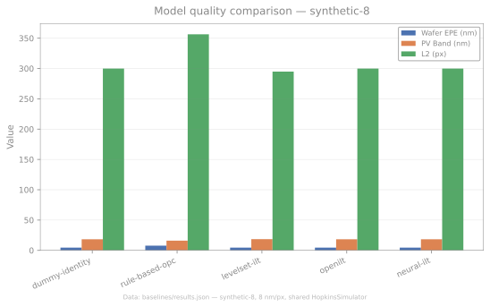

<p align="center">
  
</p>

# OpenLithoHub

> ⭐ **If you find this project helpful, please drop us a star!** It helps us get discovered by the community and is by far the most useful thing you can do for an early-stage open-source project.

**Open-source computational lithography benchmarking and workflow toolkit for advanced EUV/curvilinear mask processes.**

[](https://pypi.org/project/openlithohub/)
[](LICENSE)
[](https://www.python.org/)
[](https://github.com/OpenLithoHub/OpenLithoHub/actions)
[](https://codecov.io/gh/OpenLithoHub/OpenLithoHub)
[](https://colab.research.google.com/github/OpenLithoHub/OpenLithoHub/blob/main/notebooks/colab_byom.ipynb)

> **Website:** [openlithohub.com](https://openlithohub.com) | **Docs:** [docs.openlithohub.com](https://docs.openlithohub.com) | **Playground:** [HuggingFace Space](https://huggingface.co/spaces/OpenLithoHub/playground)

[中文版 / Chinese Version](README_zh.md) — kept in sync with this English README; if the two diverge, this English version is authoritative.

---

## What is OpenLithoHub?

OpenLithoHub provides a unified evaluation and workflow framework for computational lithography research. It bridges the gap between academic tensor-based optimization and industrial mask manufacturing by offering:

- **Unified dataset access** — single interface to LithoBench, LithoSim, GAN-OPC, ICCAD'16 hotspot, ASAP7, FreePDK45 + NanGate OCL, and ORFS-routed RISC-V layouts; OASIS / GDSII / DEF / LEF ingestion via `workflow.parse_layout`

> **Note on baselines:** The built-in baseline models are evaluated on **synthetic 64×64 toy layouts** (square, line, T, cross, etc.) to demonstrate framework correctness. They are not industrial-grade results — see [Baselines](#baselines) for methodology.

**Honesty boundaries:**
- All baseline benchmarks use synthetic 64x64 toy layouts, not industrial-scale production masks.
- No third-party experimental validation. Framework correctness is verified against published algorithm reimplementations, not foundry data.
- CPU-only benchmark timing; no GPU timing is reported.
- **Standardized metrics** — EPE (mask-vs-mask or wafer-level via forward sim), L2 wafer error (Neural-ILT canonical), PV Band, shot count, EUV stochastic robustness + imec-style per-class defect rates, hotspot detection (recall / precision / F1), plus differentiable training-time losses (SRAF non-printing penalty, curvilinear MRC)

**Known stubs / unimplemented:**
- `openlithohub.models.gan_opc.GanOpcModel` — generator-only inference without the GAN discriminator or lithography-guided training loop. Without pretrained weights, predictions are near-random.
- `openlithohub.models.neural_ilt.NeuralILTModel` — NOT a paper-faithful re-implementation of Jiang2020. The differentiable ILT correction layer is not implemented. Without pretrained weights, predictions are meaningless.
- `openlithohub.models.layout_mae.LayoutMAE` — training-runnable ViT-S MAE prototype with no pretrained weights, no fine-tune adapter API, no Hub release.
- `openlithohub._utils.resist_model.ResistCalibration.fit` — uses a scalar CD placeholder model that reduces 2D resist simulation to a single binary check per anchor. Not physically meaningful.
- **Manufacturing compliance** — MRC/DRC rule checking as hard-fail gating
- **OASIS / GDSII workflow** — end-to-end pipeline from tensor to fab-ready mask (manhattan & curvilinear); ICCAD'13 contest gauge IO + Calibre `.gg` / CSV gauge parsers; ONNX / TorchScript export with onnxruntime CI smoke test
- **Schwarz domain decomposition** — implemented in `openlithohub._utils.tiling.schwarz_tiled_ilt()`
- **Born scattering forward correction** — implemented in `openlithohub._utils.forward_model.simulate_aerial_image_born()`
- **Model-agnostic evaluation** — plug any OPC/ILT model into the benchmark via a minimal interface
- **Opt-in diffusion resist** — CAR (chemically amplified resist) with Gaussian acid diffusion, controlled by `--resist-diffusion-nm` (default `0.0` = legacy CTR). Improves EPE/PVB realism but produces **non-comparable** numbers; disabled for leaderboard submission
- **Design→litho→DFM closed-loop CLI** — `openlithohub flow run` ingests DEF/GDS/OAS or an ORFS product directory, tiles, runs litho forward sim, and produces an aggregated manufacturability report (EPE, PV Band, DRC, MRC) with configurable per-PDK layer maps
- **Optional physics plugins** — DiffNano (rigorous EM: RCWA / FDTD / FDFD + calibratable resist) and DiffCFD (Dill/Mack lithography solver + spin-coating solver + joint process optimization) as opt-in `[diffnano]` / `[diffcfd]` extras; core install needs none of them
- **JIT-accelerated forward model** — Hopkins/SOCS forward is wrapped with `torch.compile` by default, for free kernel-fusion speedups on PyTorch 2.x (use `--no-compile` to disable)

```text
┌─────────────────────────────────────────────────────────────────────────┐
│                          OpenLithoHub                                   │
├─────────────┬──────────────┬──────────────┬───────────┬─────────────────┤
│  Data Layer │  Benchmark   │   Workflow   │ Vis & UX  │      CLI        │
│ LithoBench  │  EPE/PVBand  │ Tiling/Stitch│ Paper figs│ eval / optimize │
│ LithoSim    │  MRC/DRC     │ Contour Ext. │ Jupyter   │ leaderboard     │
│ Transforms  │  Stochastic  │ OASIS Export │ EDA bridge│ simulate / synth│
│ Dummy gen.  │  Shot Count  │ B-spline Fit │           │ hackathon/export│
└─────────────┴──────────────┴──────────────┴───────────┴─────────────────┘
```

---

## Installation

> OpenLithoHub is currently in **alpha** (`0.1.0a2` on PyPI). Until a
> stable `0.1.0` is cut, install with `--pre` so pip does not skip
> pre-releases.

```bash
# Core (metrics + CLI)
pip install --pre openlithohub

# With dataset support (HuggingFace, parquet)
pip install --pre 'openlithohub[data]'

# With full workflow (KLayout, scipy for B-spline)
pip install --pre 'openlithohub[workflow]'

# Everything
pip install --pre 'openlithohub[all]'
```

Available extras: `data`, `workflow`, `models`, `jupyter`, `export`,
`docs`, `dev`, `diffnano`, `diffcfd`, `plugins` (= both), and the aggregate
`all`. Combine with comma syntax, e.g. `'openlithohub[data,workflow,jupyter]'`.

```bash
# Optional physics plugins (early-stage research, not third-party validated)
pip install --pre 'openlithohub[diffnano]'   # nanophotonics EM solvers + resist
pip install --pre 'openlithohub[diffcfd]'    # CFD-based litho + spin-coat solvers
pip install --pre 'openlithohub[plugins]'    # both
```

> **Caveat:** DiffNano and DiffCFD are optional plugins providing research-grade
> physics backends. Both self-describe as early-stage personal projects with no
> external users, no third-party validation, and no production readiness claim.
> Installing neither keeps the core lightweight.

**From source (development):**

```bash
git clone https://github.com/OpenLithoHub/OpenLithoHub.git
cd OpenLithoHub
pip install -e ".[dev]"
```

**Docker (zero-config, GPU-ready):**

Pre-built images are published to GitHub Container Registry on every release:

```bash
# CPU
docker run --rm -v "$PWD":/data ghcr.io/openlithohub/openlithohub:latest \
  eval run --model dummy-identity --dataset lithobench --data-root /data/lithobench

# GPU (requires nvidia-container-toolkit on the host)
docker run --rm --gpus all -v "$PWD":/data ghcr.io/openlithohub/openlithohub:latest \
  optimize run --input /data/design.oas --model neural-ilt --output /data/optimized.oas
```

Tagged versions are also available (e.g. `ghcr.io/openlithohub/openlithohub:0.1`).

---

## Co-Design: Lithography as Coupling Layer

OpenLithoHub's forward lithography model serves as the coupling layer that connects upstream design solvers (EM, CFD) to downstream manufacturability:

```python
from diff_surrogate import CoDesignWorkflow, CoupledLoss
from openlithohub.simulators import HopkinsSimulator, SimulatorConfig

# Lithography forward function feeds printability gradients back to design
def litho_coupling(merged_outputs):
    design_mask = merged_outputs["design"]["mask"]
    sim = HopkinsSimulator(SimulatorConfig(pixel_size_nm=1.0))
    result = sim.simulate(design_mask)
    merged_outputs["litho"] = {"aerial": result.aerial}
    return merged_outputs

wf = CoDesignWorkflow(
    design_params=torch.rand(64, 64),
    forward_fns={"design": design_forward},
    loss_fn=combined_loss,
    coupling_fn=litho_coupling,
)
```

Install `openlithohub[plugins]` to use DiffNano/DiffCFD solvers as co-design partners.

---

### Evaluate a model

```bash
openlithohub eval run \
  --model dummy-identity \
  --dataset lithobench \
  --data-root ./data/lithobench \
  --format table
```

Output:
```
┌──────────────────┬────────────────┐
│ Metric           │ Value          │
├──────────────────┼────────────────┤
│ epe_mean_nm      │ 0.0000         │
│ epe_max_nm       │ 0.0000         │
│ mrc_violation_rate│ 0.0000        │
│ mrc_passed       │ 1.0000         │
└──────────────────┴────────────────┘
```

### Run end-to-end optimization

```bash
openlithohub optimize run \
  --input design.oas \
  --model your-model \
  --writer mbmw \
  --node 3nm-euv \
  --drc-check \
  --output optimized.oas
```

### Closed-loop design→litho→DFM report

```bash
openlithohub flow run design.gds \
  --pdk asap7 --layer metal1 \
  --node 45nm --tile-nm 2000 \
  --drc --mrc \
  --output report.json
```

Accepts a standalone GDS / OAS / DEF file or an ORFS product directory.
Per-PDK layer maps are configurable (asap7, freepdk45, orfs_asap7, sky130, or
a custom JSON file). The report aggregates tile-level EPE, PV Band, DRC, and
MRC into a single JSON summary.

### Enable diffusion resist (opt-in)

```bash
# Default: CTR (constant-threshold resist), threshold=0.225 — comparable numbers
openlithohub simulate run mask.npy --resist-diffusion-nm 0.0

# Opt-in: CAR with Gaussian acid diffusion — more realistic but NON-COMPARABLE
openlithohub simulate run mask.npy --resist-diffusion-nm 20.0
```

> The scored default remains **CTR without diffusion, threshold = 0.225**.
> Enabling acid diffusion (or any plugin EM/resist backend) produces
> **non-comparable** numbers and is **disabled for leaderboard submission**.

### Run as an HTTP micro-service

For fab-side schedulers (Slurm / LSF) or legacy C++/Perl pipelines that
cannot embed Python, run the FastAPI engine and drive it with `curl`:

```bash
pip install "openlithohub[server]"
openlithohub serve --port 8000 &

curl -X POST http://localhost:8000/v1/optimize \
     -F "layout=@design.oas" \
     -F "model=your-model" \
     -F "writer=mbmw" \
     -o optimized.oas
```

Models stay resident in-process; repeat requests skip weight loading.
Open `http://localhost:8000/docs` in a browser for the auto-generated
Swagger UI: every endpoint is documented with its JSON schema and can
be exercised interactively (file upload included), no client code needed.

### Use as a Python library

The object-oriented façade — `Mask`, `LitheEngine`, `Report` — is the
shortest path from a layout file to scored results:

```python
from openlithohub import Mask, LitheEngine

mask      = Mask.from_oasis("design.oas", layer="1:0", pixel_size_nm=1.0)
engine    = LitheEngine(model="neural-ilt", node="3nm-euv")
optimized = engine.optimize(mask)
report    = engine.evaluate(optimized, target=mask)

print(report.epe_mean_nm, report.pvband_mean_nm, report.drc_violations)
optimized.to_oasis("optimized.oas")
```

The functional API stays available for fine-grained control:

```python
import torch
from openlithohub.benchmark.metrics import compute_epe, compute_pvband
from openlithohub.benchmark.compliance import check_mrc, check_drc

predicted = torch.load("predicted_mask.pt")
target = torch.load("target_mask.pt")

# Edge Placement Error
epe = compute_epe(predicted, target, pixel_size_nm=1.0)
print(f"EPE mean: {epe['epe_mean_nm']:.2f} nm")

# Process Variation Band
pvb = compute_pvband(predicted, defocus_range_nm=20.0)
print(f"PV Band: {pvb['pvband_mean_nm']:.2f} nm")

# Manufacturing compliance
mrc = check_mrc(predicted, min_width_nm=40.0, min_spacing_nm=40.0)
print(f"MRC passed: {mrc.passed} ({mrc.violation_count} violations)")
```

### Register a custom model

```python
import torch
from openlithohub.models.base import LithographyModel, PredictionResult
from openlithohub.models.registry import registry

@registry.register
class MyOPCModel(LithographyModel):
    NAME = "my-opc"
    SUPPORTS_CURVILINEAR = True

    def predict(self, design: torch.Tensor, **kwargs) -> PredictionResult:
        mask = my_optimization_algorithm(design)
        return PredictionResult(mask=mask)
```

### Paper-ready figures

```python
from openlithohub.vis import plot_contours

# Vector PDF, IEEE column-width, colorblind-safe palette
plot_contours(target, predicted, save_path="fig.pdf", style="ieee")
```

### Hermetic dummy layouts (for CI / Colab)

```python
from openlithohub.data import generate_dummy_layout

mask = generate_dummy_layout(size=256, seed=0)  # numpy + torch only, no KLayout
```

### EDA bridge (Calibre / IC Validator)

```python
from openlithohub.workflow import BridgeRules, emit_bridge_bundle

emit_bridge_bundle(
    "optimized.oas",
    BridgeRules(min_width_nm=40.0, min_spacing_nm=40.0),
)
# Writes optimized.svrf, optimized.rs, optimized.bridge.md
```

### Try it in Colab

The `notebooks/quickstart.ipynb` tutorial runs end-to-end on Colab's stock
runtime — install, generate a layout, score it, and produce a paper-ready
figure in three minutes.

> Notebook last cold-run-verified against PyPI `0.1.0a2` on 2026-05-21.

[](https://colab.research.google.com/github/OpenLithoHub/OpenLithoHub/blob/main/notebooks/quickstart.ipynb)

For plugging your own model into the harness, use the BYOM tutorial — it
walks through subclassing `LithographyModel`, running the standard metric
suite, and formatting a leaderboard submission.

[](https://colab.research.google.com/github/OpenLithoHub/OpenLithoHub/blob/main/notebooks/colab_byom.ipynb)

---

## Architecture

| Layer | Module | Description |
|-------|--------|-------------|
| **API facade** | `openlithohub.api` | OO entry points (`Mask`, `LitheEngine`, `Report`) re-exported at the package root |
| **Data** | `openlithohub.data` | Unified adapters for LithoBench (.npy), LithoSim (HuggingFace), GAN-OPC (paired PNGs), ICCAD'16 hotspot (OASIS via klayout) |
| **Benchmark** | `openlithohub.benchmark` | EPE (mask & wafer-sim), L2 wafer error, PV Band, shot count, stochastic robustness + per-class defect rates, hotspot detection, MRC/DRC compliance |
| **Models** | `openlithohub.models` | Abstract `LithographyModel` interface (`NAME` class variable) + decorator-based registry |
| **Simulators** | `openlithohub.simulators` | Forward model registry (`register_simulator`), Hopkins/SOCS built-in, Calibre/Tachyon commercial adapters (with mock mode), plugin EM backends (RCWA/FDTD/FDFD) |
| **Workflow** | `openlithohub.workflow` | Layout parsing (OASIS / GDSII / DEF / LEF), tiling, contour extraction (manhattan/curvilinear), OASIS / GDSII export, process-window OPC, OpenAccess layer-purpose helper |
| **Inference** | `openlithohub.inference` | Shared-weight multi-process inference (`multiproc_predict`), `CompiledCache` for `torch.compile` artifacts |
| **Plugins** | `openlithohub.plugins` | Optional DiffNano (EM + resist) and DiffCFD (litho + spin-coat + joint optimisation) backends |
| **Constants** | `openlithohub._constants` | Single source of truth for optical, resist, EUV 3D-mask, and plugin default values |
| **CLI** | `openlithohub.cli` | `eval`, `optimize`, `leaderboard`, `simulate`, `flow`, `synth`, `hackathon`, `export` command groups via Typer |

## Optional Physics Plugins

OpenLithoHub supports optional physics backends via the plugin system. None are
required for the core install.

| Plugin | What it adds | Install extra |
|--------|-------------|---------------|
| **DiffNano** | Rigorous EM simulators (RCWA / FDTD / FDFD) + calibratable resist model (acid diffusion, PEB, development contrast) — registered as `diffnano_rcwa`, `diffnano_fdtd2d`, `diffnano_fdfd2d` backends | `[diffnano]` |
| **DiffCFD** | Differentiable steady-state CFD — Dill/Mack lithography solver, Meyerhofer spin-coating solver, and joint process optimization (`optimize_joint_process`) | `[diffcfd]` |

```bash
pip install --pre 'openlithohub[plugins]'   # installs both
```

**Caveats:**
- Both plugins are early-stage research with no external users or third-party
  validation. Do not use for production decisions.
- Plugin EM/resist backends produce **non-comparable** metric values. Built-in
  Hopkins + CTR (threshold `0.225`) remains the only path for leaderboard
  submission.
- Optionality is justified by unvalidated status, install footprint, and
  independent iteration cadence — not by dependency weight (all are PyTorch-native).

---

## Metrics

| Metric | Description | Reference |
|--------|-------------|-----------|
| **EPE** | Edge Placement Error — distance between predicted and target contour edges | Standard |
| **PV Band** | Process Variation Band — resist contour variation across dose/focus window | Standard |
| **Shot Count** | Mask write time proxy for MBMW and VSB writers | Industry |
| **Stochastic Robustness** | Monte Carlo photon noise simulation for bridge/break probability | EUV-specific |
| **MRC** | Minimum width/spacing rule check (hard-fail) | EasyMRC |
| **Curvilinear MRC** | Minimum curvature radius + minimum feature area for post-ILT curvilinear shapes (MBMW writability) | EUV-specific |
| **DRC** | Design Rule Check: area, notch, width, spacing | OpenDRC |

> **Diffusion resist:** EPE and PV Band can optionally run through the CAR acid-diffusion
> model (`--resist-diffusion-nm`). The scored default remains CTR at threshold `0.225`;
> enabling diffusion produces **non-comparable** numbers and is disabled for leaderboard
> submission. Absolute wafer prediction still needs user-calibrated, foundry-confidential
> parameters — the framework is benchmark-relative, not absolute-predictive.

---

## Supported Datasets

| Dataset | Format | Process Node | Task | Source |
|---------|--------|--------------|------|--------|
| **LithoBench** | NumPy .npy | 45nm | Mask optimization | NeurIPS'23 |
| **LithoSim** | HuggingFace Parquet | Sub-28nm | Mask optimization | NeurIPS'25 |
| **GAN-OPC** | Paired PNGs | — | AI-OPC training | TCAD'20 |
| **ICCAD'16 Problem C** | OASIS + CSV | N7 EUV | Hotspot detection | ICCAD'16 |
| **ASAP7 standard cells** | GDSII (klayout) | 7nm predictive | PDK-aware OPC | The-OpenROAD-Project/asap7 |
| **FreePDK45 + NanGate OCL** | GDSII (klayout) | 45nm predictive | PDK-aware OPC | mflowgen/freepdk-45nm |
| **ORFS-routed ASAP7** | GDSII (klayout) | 7nm | RISC-V tile-cut hotspots | OpenROAD-flow-scripts |

---

## Performance & Benchmarks

> All numbers are obtained by running bundled benchmark scripts on real
> hardware. No data has been estimated, extrapolated, or "reasonably assumed."
> See [`docs/benchmarks.md`](docs/benchmarks.md) for methodology, forward
> model configuration, and per-pattern breakdowns.

### Model quality — synthetic-8 (Table 1)

Eight hand-crafted 64×64 layouts (square, h-line, line/space, T, L, cross,
contacts, dense lines) at 8 nm/px, graded with a single shared
`HopkinsSimulator` (wavelength / NA / threshold identical for every row).

| Model | EPE mean (nm) | Wafer EPE (nm) | L2 (px) | PVB mean (nm) | MRC pass |
|---|---|---|---|---|---|
| `dummy-identity` | 0.000 | 4.529 | 299.9 | 18.340 | 88% |
| `rule-based-opc` | 4.242 | 7.786 | 356.4 | 16.000 | 88% |
| `levelset-ilt` (200 iter) | 0.322 | 4.482 | 294.9 | 18.516 | 75% |
| `openilt` (MOSAIC L2+PVB) | 0.000 | 4.529 | 299.9 | 18.340 | 88% |
| `neural-ilt` (v0.1 seed) | 0.000 | 4.529 | 299.9 | 18.340 | 88% |

- **`levelset-ilt`** is the only model that improves wafer L2 (294.9 vs
  identity's 299.9), at the cost of a lower MRC pass rate (75%) — the
  gradient-descent mask creates narrow features that violate
  `min_width_nm=40`.
- **`openilt`** and **`neural-ilt`** converge to identity on these simple
  patterns — their forward model already reproduces the target without
  modification. They diverge on real layouts with non-trivial corner
  rounding.
- **`rule-based-opc`** intentionally deviates from the target mask (mask-EPE
  rises to 4.242 nm) but reduces PVB (16.0 vs 18.3 nm) — the expected
  bias-OPC trade-off.
- **`dummy-identity`** is a *floor*, not a competitor — mask-EPE is zero by
  construction (design == target) but wafer-EPE and L2 are nonzero due to
  diffraction.

### Model quality — ICCAD16 testcase1 (Table 2)

Real EUV layout (1.9 µm × 1.5 µm, 475×375 px at 4 nm/px) from
[Yang2016_ICCAD16Bench](https://github.com/phdyang007/ICCAD16-N7M2EUV).
EPE/L2 columns omitted — the dataset ships no reference OPC mask.

| Model | PVB mean (nm) | PVB max (nm) | MRC viol rate |
|---|---|---|---|
| `dummy-identity` | 14.82 | 64.0 | 15.93% |
| `rule-based-opc` | 12.39 | 32.0 | 14.89% |
| `levelset-ilt` | 10.49 | 32.0 | 0.97% |
| `openilt` | 14.82 | 64.0 | 15.93% |
| `neural-ilt` (v0.1) | 0.00 | 0.0 | 0% |
| `gan-opc` (v0.1) | 10.97 | 48.0 | 8.48% |
| `gan-opc` (v0.2) | 11.76 | 64.0 | 5.99% |

- **`levelset-ilt`** achieves the best PVB (10.49 nm) with near-zero MRC
  violations (0.97%) — same ranking as synthetic-8.
- **`neural-ilt` v0.1** shows a degenerate result (zero PVB, zero violations)
  because weights trained on synthetic 64-px tiles produce a near-blank mask
  on the 475×375 grid — this is an **out-of-distribution failure**, not a
  competitive score.
- **`gan-opc` v0.2 vs v0.1**: MRC violations drop 29% (8.48%→5.99%) but PVB
  rises 7% (10.97→11.76 nm), reflecting the Hopkins-in-the-loop trade-off.

### Cross-reference with published results (Table 3)

Comparing OpenLithoHub's reimplementations against original paper results.
**Non-strict same-condition comparison, for reference only** — test layouts,
process nodes, and evaluation methodologies differ. All paper numbers are from
ICCAD 2013 contest benchmarks (10 clips, 32 nm M1, 1024 nm × 1024 nm, 1 nm/px);
OpenLithoHub numbers are from ICCAD16 testcase1 (7 nm EUV, 475 × 375 px,
4 nm/px) — a fundamentally different benchmark.

| Method | Source | Reported (ICCAD13) | OpenLithoHub reimpl. (ICCAD16) | Caveats |
|---|---|---|---|---|
| MOSAIC (SGD, L2+PVB) | Gao et al., DAC 2014 (DOI [6881379](https://ieeexplore.ieee.org/document/6881379)) | PVB avg ≈ 56 890 nm², TAT ≈ 1703 s | PVB 14.82 nm (identity) | OpenILT converges to identity on clean patterns; ICCAD13 vs ICCAD16 metrics not directly comparable |
| Neural-ILT (U-Net) | Jiang et al., ICCAD 2020 (DOI [3415704](https://dl.acm.org/doi/10.1145/3400302.3415704)) | L2 avg 38 504 nm², TAT ≈ 11 s (GPU) | N/A (degenerate on ICCAD16) | v0.1 trained on synthetic only; paper uses 2048×2048 masks on GPU |
| GAN-OPC (PGAN-OPC) | Yang et al., DAC 2018 / TCAD 2020 (DOI [3196056](https://dl.acm.org/doi/10.1145/3195970.3196056)) | L2 avg 39 949 nm², TAT ≈ 371 s | PVB 10.97 nm, MRC viol 8.48% | Paper reports L2 (nm²); we report PVB (nm) — different metrics and layouts |
| curvyILT | Yang & Ren, ISPD 2025 / arXiv [2411.07311](https://arxiv.org/abs/2411.07311) | MSE avg 25 991 nm², 2.11 s/clip (RTX A6000) | — (not yet integrated) | External GPU tool; best published academic SOTA on ICCAD13 |

### Optimization throughput (Table 4)

All timing measured with `perf_counter_ns`, `gc.disable()` during sampling,
100 samples (forward models / metrics) or 20 samples (full model predictions),
median and P99 reported. CPU only (no GPU).

| Benchmark | Grid | Median | P99 | Device |
|---|---|---|---|---|
| `forward_gaussian` | 64×64 | 238 µs | 549 µs | AMD 5600G CPU |
| `forward_gaussian` | 256×256 | 804 µs | 1.2 ms | AMD 5600G CPU |
| `forward_hopkins` | 64×64 | 2.1 ms | 2.7 ms | AMD 5600G CPU |
| `forward_hopkins` | 256×256 | 6.5 ms | 9.5 ms | AMD 5600G CPU |
| `metric_epe` | 64×64 | 541 µs | 941 µs | AMD 5600G CPU |
| `metric_pvband` | 64×64 | 1.4 ms | 3.6 ms | AMD 5600G CPU |
| `metric_epe` | 256×256 | 2.0 ms | 4.1 ms | AMD 5600G CPU |
| `metric_pvband` | 256×256 | 6.7 ms | 7.5 ms | AMD 5600G CPU |
| `model_dummy-identity` | 64×64 | 4 µs | 106 µs | AMD 5600G CPU |
| `model_rule-based-opc` | 64×64 | 632 µs | 1.3 ms | AMD 5600G CPU |
| `model_levelset-ilt` (10 iter) | 64×64 | 17.9 ms | 20.7 ms | AMD 5600G CPU |

- **Hopkins is ~8× slower than Gaussian** (2.1 ms vs 238 µs at 64×64) —
  the SOCS SVD decomposition is the bottleneck.
- **`levelset-ilt` 10 iterations** takes ~18 ms per 64×64 tile; 200 iterations
  would scale to ~360 ms. This is consistent with the iterative gradient-descent
  nature of the algorithm.
- GPU timing is not reported — OpenLithoHub's models run on CPU by default.
  Neural-ILT (Jiang et al., ICCAD 2020) reports ~11 s on GPU for the same
  task; direct comparison is not meaningful without matching hardware.

> **Surrogate-ILT** uses an on-the-fly trained surrogate forward model and
> reports 10–50× speedup relative to the full-physics Hopkins forward model
> — this is an internal relative measurement, not a wall-clock comparison
> with external tools.

### How to reproduce

**Hardware:** AMD Ryzen 5 5600G (6C/12T), 13 GB DDR4, SATA SSD, Ubuntu 24.04 (kernel 6.8.0)

**Software:** CPython 3.10.12, PyTorch 2.12.0+cpu, OpenLithoHub `4c3a699` (main)

```bash
# Model quality (synthetic-8):
python3 scripts/generate_baselines.py --synthetic --limit 8 --output baselines/

# Model quality (ICCAD16 testcase1):
openlithohub eval run --model levelset-ilt --dataset iccad16 \
  --data-root data/iccad16 --node 7nm --pixel-nm 4.0

# Performance timing:
python3 scripts/benchmark_performance.py --json results_timing.json

# Generate comparison charts:
python3 scripts/plot_benchmarks.py --input baselines/results.json --output docs/images/
```

**Methodology:** Synthetic-8 numbers are averaged across 8 patterns per model,
single run. ICCAD16 is a single testcase, single run. No statistical sampling
across seeds. Timing benchmarks use `perf_counter_ns`, `gc.disable()` during
measurement, and report median / P95 / P99 over 100 samples (forward models)
or 20 samples (full model predictions).

> All test data is obtained by actually running the above commands on the
> above hardware, without any subjective estimation. Readers can reproduce
> the results by running the same commands.

### Visualization

```bash
python scripts/plot_benchmarks.py \
  --input baselines/results.json \
  --output docs/images/
```



Charts use transparent-background SVG with neutral-gray (#888) axis labels
for readability in both light and dark GitHub themes.

---

## Optical forward models

OpenLithoHub ships two differentiable forward models, both written in pure
PyTorch so the entire ILT loop is end-to-end auto-differentiable:

| Model | Module | Notes |
|---|---|---|
| Gaussian PSF | `openlithohub._utils.forward_model.simulate_aerial_image` | Single-Gaussian convolution; cheap default for tests and small grids |
| Hopkins SOCS | `openlithohub._utils.hopkins.simulate_aerial_image_hopkins` | Partial-coherent imaging via SVD-truncated Sum-Of-Coherent-Systems; supports circular / annular / dipole illumination |
| DiffNano RCWA/FDTD/FDFD | `openlithohub.plugins.diffnano_em` (opt-in) | Rigorous EM solvers via the DiffNano plugin; registered as `diffnano_rcwa`, `diffnano_fdtd2d`, `diffnano_fdfd2d` backends |

Built-in Hopkins remains the default and the only comparable path for leaderboard
numbers. Plugin EM backends are opt-in and produce non-comparable scores.

### Schwarz Domain Decomposition (Tiling)

`schwarz_tiled_ilt()` in `openlithohub._utils.tiling` implements alternating Schwarz domain decomposition for large-layout ILT. Adjacent tiles exchange overlap boundary data at each iteration, with convergence monitoring (residual norm). This replaces naive independent tiling with a solver that enforces inter-tile consistency:

```python
from openlithohub._utils.tiling import schwarz_tiled_ilt

result = schwarz_tiled_ilt(
    mask, tile_size=512, overlap=64, max_schwarz_iter=10, tol=1e-4,
)
```

### Born Scattering Forward Correction

`simulate_aerial_image_born()` in `openlithohub._utils.forward_model` extends the Hopkins Gaussian PSF forward model with higher-order Born scattering terms for thick-mask effects. This captures edge diffraction and sidewall scattering that the thin-mask (Hopkins-only) model misses:

```python
from openlithohub._utils.forward_model import simulate_aerial_image_born

aerial = simulate_aerial_image_born(
    mask, sigma_nm=20.0, born_order=2,  # Hopkins + 2nd-order correction
)
```

Switch `LevelSetILTModel` to Hopkins:

```python
from openlithohub._utils import HopkinsParams
from openlithohub.models.levelset_ilt import LevelSetILTModel

model = LevelSetILTModel(
    iterations=200,
    forward_model="hopkins",
    hopkins_params=HopkinsParams(
        wavelength_nm=193.0, na=1.35, sigma=0.7, num_kernels=24, pixel_size_nm=2.0,
    ),
)
```

### Commercial simulator adapters

OpenLithoHub ships adapters for Calibre nmOPC and ASML Brion Tachyon.
Both fall back to a deterministic mock when the commercial toolchain is
not installed, so tests pass on any machine:

```python
from openlithohub.simulators import CalibreSimulator, TachyonSimulator
from openlithohub.simulators import SimulatorConfig

# Calibre nmOPC (requires calibre on PATH; mock_mode=True otherwise)
calibre = CalibreSimulator(SimulatorConfig(pixel_size_nm=4.0, mock_mode=True))
result = calibre.simulate(mask_tensor)

# ASML Brion Tachyon (requires TACHYON_HOME; mock_mode=True otherwise)
tachyon = TachyonSimulator(SimulatorConfig(pixel_size_nm=4.0, mock_mode=True))
result = tachyon.simulate(mask_tensor)
```

---

## Development

```bash
# Run tests
pytest tests/ -v

# Lint
ruff check src/ tests/

# Type check
mypy src/

# Format
ruff format src/ tests/

# Check plugin infrastructure health
make check-plugins
```

### Multi-worker batch inference

For production-scale scoring, `multiproc_predict` distributes tiles across
worker processes with shared model weights via `SharedMemory`:

```python
from openlithohub.inference import multiproc_predict
from openlithohub.models import get_model

model = get_model("neural-ilt")
tiles = [mask_tile_1, mask_tile_2, mask_tile_3, mask_tile_4]

results = multiproc_predict(model, tiles, n_workers=2)
```

---

## Roadmap

- [x] Milestone 1: Unified data adapters, EPE metric, `eval` CLI
- [x] Milestone 2: MRC compliance, Manhattan contour extraction, tiling, shot count
- [x] Milestone 3: OASIS workflow, PV Band, stochastic robustness, DRC, B-spline fitting, `optimize` CLI
- [x] Milestone 4: Public leaderboard, MkDocs documentation site, CI/CD for docs
- [x] Milestone 5: Web playground (HuggingFace Spaces)
- [x] Milestone 6: Real ILT models (LevelSet-ILT, Neural-ILT U-Net), DTCO process nodes, resist simulation, model hub, Jupyter integration, PyPI/Docker CI/CD
- [x] Milestone 7: Paper-ready visualization, dummy layout generator, EDA bridge templates, Colab quickstart
- [x] Milestone 8: Multi-stage KLayout Docker, AI-engineer terminology guide, Auto-Leaderboard CI, community charter (Discord), v0.1 launch announcement
- [x] Milestone 9: PDK-aware synthetic layout generator, vendor-neutral simulator hook API, EUV 3D-mask shadow proxy, Monte Carlo failure metric, Mini-Hackathon (2026-Q3), RFC 0001 (Layout-MAE) + RFC 0002 (Layout Tokens)
- [x] Milestone 10: Real PDK rollout — ASAP7 standard cells, FreePDK45 + NanGate OCL, ORFS-routed RISC-V mock-alu (issue [#4](https://github.com/OpenLithoHub/OpenLithoHub/issues/4))
- [x] Milestone 11: Standard MRC rule-deck schema (RFC 0003), measured-source / Zernike-pupil I/O, Calibre/CSV gauge parser, `openlithohub export` CLI (ONNX / TorchScript / TensorRT-ready), `--compile` on by default, first PyPI release (`openlithohub-0.1.0a2`)
- [x] Milestone 12: Opt-in diffusion resist (`--resist-diffusion-nm`), `openlithohub flow run` closed-loop CLI (design→litho→DFM), configurable per-PDK layer maps, optional DiffNano/DiffCFD plugin ecosystem

> **Note:** Milestones above reflect feature integration completeness (adapters, CLI commands, CI pipelines), not industrial validation. The alpha version (`0.1.0a2`) runs on synthetic layouts — real industrial-scale benchmarking is planned for the v1.0 milestone.

---

## Related Projects

| Project | Venue | Role in Ecosystem |
|---------|-------|-------------------|
| LithoSim | NeurIPS'25 | Sub-28nm industrial dataset |
| LithoBench | NeurIPS'23 | 45nm evaluation framework |
| TorchLitho 2.0 | ASICON'25 | Differentiable lithography simulator |
| [curvyILT](https://github.com/phdyang007/curvyILT) | NVIDIA arXiv'24 | GPU-accelerated curvilinear ILT |
| EasyMRC | TODAES'25 | MRC reference implementation |
| ILT challenges survey | Light: Sci. Appl. 2025 | Comprehensive survey of ILT challenges and solutions |
| B-spline + Delaunay curvilinear mask | arXiv:2504.11962, 2025 | Curvilinear mask optimization via B-spline and Delaunay triangulation |
| Full-chip EUV curvilinear mask optimization | Light: Advanced Manufacturing, 2026, doi:10.37188/lam.2026.049 | Full-chip EUV curvilinear mask optimization |
| Schwarz Neural Inference | arXiv:2504.00510 v2, 2026-02 | Local→global domain decomposition operator learning — applicable to ILT solver acceleration |
| ML4PS optical diffraction convolution | NeurIPS 2025 | ML for physical simulation: optical diffraction convolution |
| [DiffNano](https://github.com/OpenLithoHub/DiffNano) | — | Optional plugin: PyTorch-native nanophotonics (RCWA / FDTD / FDFD + calibratable resist). Early-stage research, no third-party validation. |
| [DiffCFD](https://github.com/OpenLithoHub/DiffCFD) | — | Optional plugin: PyTorch-native steady-state CFD for lithography (Dill/Mack solver, spin-coating solver, joint process optimization). Early-stage research, no third-party validation. |

---

## Contributing

See [CONTRIBUTING.md](CONTRIBUTING.md) for guidelines.

---

## Community


A **Discord** server for OpenLithoHub is launching **2026-Q3** — channels
for model discussion, physics simulation, help, and showcase. The place
to debate model design, reproducibility, and benchmarks.

Want to be notified when the invite goes live? **[Open an issue with the
`community` label](https://github.com/OpenLithoHub/OpenLithoHub/issues/new?labels=community&title=Community+launch+notification)**
or watch this repo. Charter, channel structure, etiquette, and onboarding
flow are documented in [docs/community.md](docs/community.md).

📣 **Read the launch announcement:**
[v0.1 release post](docs/announcements/2026-05-launch.md) — includes
paste-ready copy for X / LinkedIn / 知乎 / HuggingFace Forum.

🏆 **Mini-hackathon launching 2026-Q3** —
[charter & rules](docs/hackathon.md). EPE target, frozen test split,
hard MRC/DRC gate, separate leaderboard track.

---

## Disclaimer

**OpenLithoHub is a purely academic, open-source project for fundamental research in computational physics and machine learning. It relies solely on publicly available datasets and published algorithms. It does not contain, nor does it seek to reverse-engineer, any proprietary commercial EDA tools or export-controlled manufacturing processes.**

**Plugin validation:** DiffNano and DiffCFD are optional plugins that self-describe
as early-stage personal research projects with no external users and no third-party
validation. Do not rely on them for production decisions.

**Leaderboard comparability:** The scored default is CTR (constant-threshold resist)
without diffusion, at threshold `0.225`. Enabling acid diffusion (`--resist-diffusion-nm > 0`)
or switching to a plugin EM/resist backend produces **non-comparable** metric values
and is disabled for leaderboard submission.

## License

OpenLithoHub uses a layered licensing model:

- **Code** — [Apache License 2.0](LICENSE)
- **Documentation** — [CC-BY-SA 4.0](LICENSE-DOCS)
- **Datasets** — each dataset retains its original license; OpenLithoHub
  ships only adapters, not data. See [DATA-LICENSES.md](DATA-LICENSES.md).
- **Third-party components** — see [NOTICE](NOTICE).

You may freely use OpenLithoHub commercially under the open-source license
(attribution and the `NOTICE` file are the only requirements). For commercial
licensing options without attribution or with
SLA-backed support, see [COMMERCIAL-USE.md](COMMERCIAL-USE.md).

To cite OpenLithoHub in academic work, see [CITATION.cff](CITATION.cff).
Contributors: please review [CONTRIBUTING.md](CONTRIBUTING.md) and the
[Contributor License Agreement](CLA-INDIVIDUAL.md). Security issues:
[SECURITY.md](SECURITY.md).
