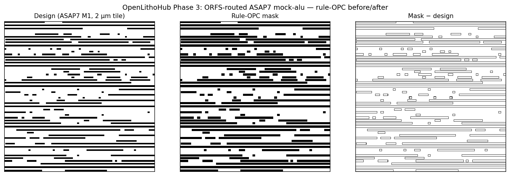

# Benchmarks

This page tracks the canonical baseline numbers for OpenLithoHub's bundled
ILT models, plus the differentiable forward models that drive them.

## Headline baseline (synthetic-8)

Numbers are produced by

```bash
python scripts/generate_baselines.py --synthetic --limit 8 --output baselines/
```

against eight hand-rolled 64×64 layouts (square, h-line, line/space, T,
L, cross, contacts, dense lines). The synthetic suite is dataset-free and
runs in seconds, which is why it is the published reference. Real-dataset
numbers can be regenerated locally with `--data-root <path>`.

| Model | Samples | EPE mean (nm) | Wafer EPE (nm) | L2 (px) | PVB (nm) | MRC pass |
|---|---|---|---|---|---|---|
| `dummy-identity` | 8 | 0.000 | 4.529 | 299.9 | 18.340 | 88% |
| `rule-based-opc` | 8 | 4.242 | 7.786 | 356.4 | 16.000 | 88% |
| `levelset-ilt` (Gaussian PSF) | 8 | 0.322 | 4.482 | 294.9 | 18.516 | 75% |
| `openilt` (L2 + PVBand) | 8 | 0.000 | 4.529 | 299.9 | 18.340 | 88% |
| `neural-ilt` (v0.1 seed weights) | 8 | 0.000 | 4.529 | 299.9 | 18.340 | 88% |

Things worth knowing about these numbers:

- The synthetic patterns are now graded at **8 nm/px** so the 64×64 canvas
  covers a 512 nm window — large enough that 193 nm ArF diffraction
  actually resolves edges. At 1 nm/px (the previous default) every
  feature collapsed sub-resolution and wafer-level metrics were degenerate.
- **`dummy-identity`** copies the design straight through. Its mask-EPE is
  zero by construction (design == target), but its wafer-EPE and L2 are
  nonzero because Hopkins diffraction rounds Manhattan corners — that is
  the whole point of OPC. Identity exists as a *floor*, not a competitor.
- **`rule-based-opc`** applies analytic per-edge bias OPC. The bias
  *increases* mask-EPE (the printed mask intentionally differs from the
  target) and L2 — on this synthetic suite it is over-corrected. Useful
  as a non-trivial baseline below the ILT methods.
- **`levelset-ilt`** runs 200 iterations of gradient-descent ILT under the
  default Gaussian PSF forward model (`sigma_px=2.0`). It is the *only*
  model that beats Identity on wafer L2 (294.9 vs 299.9) on this suite;
  the lower MRC pass rate reflects narrow features that fall under the
  default `min_width_nm=40` rather than an optimizer regression. Run
  against a real LithoBench layout or relaxed MRC thresholds for
  production-grade numbers.
- **`openilt`** is the
  [OpenILT](https://github.com/OpenOPC/OpenILT)-style baseline (clean-room
  PyTorch reimplementation of the SimpleILT formulation, MIT-licensed
  upstream pinned at commit
  [`dabb97c`](https://github.com/OpenOPC/OpenILT/commit/dabb97c6ca3dfd159362e48273c436444c77353b)).
  Optimizes the MOSAIC L2 + PVBand objective with SGD across a 3-corner
  dose/defocus sweep. On the synthetic 64×64 suite SGD converges to
  ≈Identity (its internal forward model already prints the target
  cleanly so no improvement is found); it diverges from Identity once
  fed real production layouts where corner rounding and end-shortening
  are non-trivial. Citation: Gao et al., "MOSAIC", DAC 2014.
- **`neural-ilt`** is a U-Net mask predictor. Public seed weights for
  v0.1 are released on HuggingFace as
  [`openlithohub/neural-ilt-v0.1`](https://huggingface.co/openlithohub/neural-ilt-v0.1) —
  `NeuralILTModel(pretrained=True)` and
  `scripts/generate_baselines.py --pretrained` (default) both pull
  them. v0.1 was trained on synthetic dummy layouts, so on this suite
  it lands at the same numbers as Identity / OpenILT; a v1.0
  LithoBench-trained release is planned and will diverge. With
  `--no-pretrained` the model falls back to a randomly-initialised
  U-Net, which is what the older "no-weights" numbers reflected.

## Reproducing on real data

Once you have LithoBench cached locally:

```bash
python scripts/generate_baselines.py \
  --data-root /path/to/lithobench \
  --limit 16 \
  --pixel-nm 1.0 \
  --output baselines/lithobench/
```

The same `results.json` / `results.md` artifacts land under the chosen
output directory. Submit them to the public leaderboard with
`openlithohub leaderboard submit --file <results.json>`.

## ORFS-routed ASAP7 — RISC-V mock-alu (issue #4 Phase 3)

OpenLithoHub also supports real ASAP7-routed RTL→GDSII outputs via the
`OrfsArtifactDataset` adapter. The first end-to-end target is
`mock-alu` from
[OpenROAD-flow-scripts](https://github.com/The-OpenROAD-Project/OpenROAD-flow-scripts):
the smallest RISC-V-style ALU design that exercises a complete flow
(yosys → OpenROAD → routed GDS) in ~25 minutes on a Linux runner.

The adapter rasterizes one design layer of the routed block, then cuts
it into fixed-size tiles. The default 2 µm × 2 µm and 5 µm × 5 µm
windows match the AI-OPC inference scales used in the literature.



To produce the GDS, trigger the
[`build-asap7-mock-alu` workflow](https://github.com/OpenLithoHub/OpenLithoHub/actions/workflows/build-asap7-mock-alu.yml)
(`gh workflow run build-asap7-mock-alu.yml`), download the artifact,
and run:

```bash
.venv/bin/openlithohub eval run \
  --dataset orfs --node 7nm --accept-license \
  --data-root /path/to/6_final.gds \
  --tile-nm 2000 --pixel-nm 4.0 \
  --no-drc --no-mrc \
  --model dummy-identity
```

| Window | Tiles total | PVB mean (nm) | PVB max (nm) |
|---|---|---|---|
| 2 µm × 2 µm | 729 | 15.073 | 29.600 |
| 5 µm × 5 µm | 121 | 14.980 | 39.600 |

ORFS pinned at `74b5f96`; metal1 layer 20/0; `pixel_nm=4.0` (a 1 nm
grid would be 16× more pixels and the PV-band convolution scales
O(N²)). Linux-only locally — see
[`scripts/build_riscv_alu.sh`](https://github.com/OpenLithoHub/OpenLithoHub/blob/main/scripts/build_riscv_alu.sh)
for the equivalent local commands.

## Hotspot detection — ICCAD 2016 Problem C

The ICCAD'16 EUV hotspot benchmark is wired in via
`openlithohub.data.Iccad16Dataset` (klayout-based OASIS rasterizer) and
the point-matching metric `compute_hotspot_detection`. Together they
support a separate baseline track from the mask-optimization numbers
above — the data has no reference mask, so EPE / PVB / MRC do not apply.

### Dataset

- 4 published test cases (`testcase{1..4}.oas` + `test{1..4}.csv`)
  mirrored at https://github.com/phdyang007/ICCAD16-N7M2EUV.
- Layer `(1000, 0)` is the design polygons; layer `(10000, 0)` is the
  hotspot-detection clip-site grid (16×16 nm windows, ~120 per case),
  exposed via `LithoSample.metadata['clip_sites']`.
- Hotspot annotations live in `metadata['hotspots']` as
  `(hotspot_id, category_id, x_nm, y_nm)` rows. The contest's
  category-id-to-defect-kind mapping (EPE / Bridging / Necking) is
  not published, so the loader preserves the raw integer.
- `LithoSample.mask` is intentionally `None` for this dataset.

### Metric

`compute_hotspot_detection(predicted_points, ground_truth_points,
match_radius_nm)` does greedy point-matching: each predicted point
counts as a TP iff an unmatched GT point lies within
`match_radius_nm`. Returns
`{num_tp, num_fp, num_fn, recall, precision, f1}`. Edge cases follow
sklearn convention — empty-vs-empty is a vacuous perfect score; empty
predictions against present GT give recall=0, precision=1.0.

### Baselines

Sanity baselines (not ML predictors) are produced by:

```bash
python scripts/run_hotspot_baseline.py \
  --data-root data/iccad16 \
  --output out/hotspot \
  --match-radius-nm 100.0
```

Numbers below are from `testcase1` (18 GT hotspots) at
`match_radius_nm=100` — the strict 1 nm radius is shown in the script's
default output and gives all-zero TP for these strawman predictors.

| Model | GT | Predicted | TP | FP | FN | Recall | Precision | F1 |
|---|---|---|---|---|---|---|---|---|
| `empty` | 18 | 0 | 0 | 0 | 18 | 0.000 | 1.000 | 0.000 |
| `grid-200nm` | 18 | 80 | 2 | 78 | 16 | 0.111 | 0.025 | 0.041 |
| `clip-centers` | 18 | 120 | 1 | 119 | 17 | 0.056 | 0.008 | 0.014 |

Things worth knowing:

- **`empty`** predicts nothing. It pins the recall floor (0.0) while
  scoring vacuous precision=1.0; useful as a "metric is alive" check.
- **`grid-200nm`** rasters predictions on a 200 nm lattice over the
  design bbox. Saturates the FP rate to expose the recall ceiling
  attainable by a brute-force "guess everywhere" predictor.
- **`clip-centers`** treats the auxiliary clip-site layer as a predictor.
  It performs near-zero — confirming our empirical finding that the
  clip-site grid is an inspection-window layer, not a hotspot mask.
  The 70+ nm separation between clip centers and CSV hotspots makes
  this baseline a useful regression check against anyone re-mistaking
  layer 10000 for ground truth.

A real ML predictor (CNN, ViT, etc.) plugs into the same script by
adding a function to the `PREDICTORS` dict that consumes a
`LithoSample` and returns an `(N, 2)` tensor of nm-coordinates.

## GAN-OPC paired-mask dataset

`openlithohub.data.GanOpcDataset` exposes the ~4875 paired-PNG training
set from Yang et al., *GAN-OPC: Mask Optimization with
Lithography-guided Generative Adversarial Nets* (DAC 2018, open-access
[arXiv:1810.04293](https://arxiv.org/abs/1810.04293); a paywalled TCAD
2020 extension exists but the DAC paper is canonical). Source:
https://github.com/phdyang007/GAN-OPC (multi-volume 7z archive,
unpacks to `ganopc-data/{artitgt,artimsk}/N.glp.png` +
`N.glpOPC.png`).

```python
from openlithohub.data import GanOpcDataset

ds = GanOpcDataset("data/ganopc/extracted")  # parent of ganopc-data/
sample = ds[0]
sample.design  # (2048, 2048) torch.float32, {0., 1.}
sample.mask    # (2048, 2048) torch.float32, {0., 1.}
```

The pairs are `(design_layout, OPC_mask)` so this dataset is suitable
for AI-OPC training and for evaluating mask-optimization models with
the standard EPE / PVB / shot-count / MRC metric stack — though no
canonical baseline numbers are published here yet.

## Differentiable forward models

Two forward models ship in `openlithohub._utils`. Both are pure PyTorch
and auto-differentiable, so they slot directly into ILT optimization
loops, AI-OPC training, or any downstream gradient-based pipeline.

### Gaussian PSF (default)

`simulate_aerial_image(mask, sigma_px, dose=1.0)` — a single Gaussian
point spread function convolved with the mask. Fast, faithful enough for
unit tests and small synthetic patterns, and used as the default in
`LevelSetILTModel`.

### Hopkins partial-coherent imaging (SOCS)

`simulate_aerial_image_hopkins(mask, params)` implements the Sum-of-Coherent-
Systems decomposition of the Hopkins transmission cross coefficient. It
captures partial coherence, off-axis illumination, and defocus, which
the Gaussian model cannot.

Configurable via `HopkinsParams`:

| Field | Default | Meaning |
|---|---|---|
| `wavelength_nm` | 193.0 | Exposure wavelength (193 nm = ArF, 13.5 nm = EUV) |
| `na` | 1.35 | Numerical aperture (image-side) |
| `sigma` | 0.7 | Partial-coherence factor; outer sigma for annular/dipole/quasar |
| `sigma_inner` | 0.0 | Inner sigma for off-axis illumination |
| `pixel_size_nm` | 1.0 | Physical mask pixel size |
| `num_kernels` | 24 | SOCS truncation order |
| `illumination` | `"circular"` | One of `circular`, `annular`, `dipole`, `quasar` |
| `dipole_angle_deg` | 0.0 | Pole-pair orientation for dipole/quasar |
| `defocus_nm` | 0.0 | Defocus offset (parabolic phase) |

Switch `LevelSetILTModel` to Hopkins:

```python
from openlithohub._utils import HopkinsParams
from openlithohub.models.levelset_ilt import LevelSetILTModel

model = LevelSetILTModel(
    iterations=200,
    forward_model="hopkins",
    hopkins_params=HopkinsParams(
        wavelength_nm=193.0,
        na=1.35,
        sigma=0.7,
        num_kernels=24,
        pixel_size_nm=2.0,
    ),
)
result = model.predict(design)  # standard PredictionResult
```

The kernels are computed once and cached per `(params, grid_size, device)`,
so iterative ILT loops pay the SVD cost a single time.
