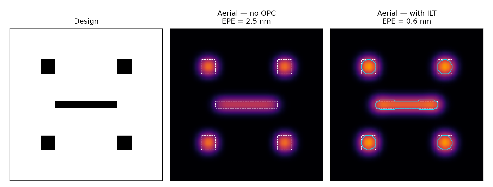

# OpenLithoHub

**Open-source computational lithography benchmarking and workflow toolkit for advanced EUV/curvilinear mask processes.**



---

## Overview

OpenLithoHub provides a unified evaluation and workflow framework for computational lithography research. It bridges the gap between academic tensor-based optimization and industrial mask manufacturing.

```text
┌─────────────────────────────────────────────────────────────────┐
│                       OpenLithoHub                              │
├─────────────┬──────────────┬──────────────┬───────────┬─────────┤
│  Data Layer │  Benchmark   │   Workflow   │ Vis & UX  │   CLI   │
│ LithoBench  │  EPE/PVBand  │ Tiling/Stitch│ Paper figs│ eval    │
│ LithoSim    │  MRC/DRC     │ Contour Ext. │ Jupyter   │ optimize│
│ Transforms  │  Stochastic  │ OASIS Export │ EDA bridge│leaderbd │
│ Dummy gen.  │  Shot Count  │ B-spline Fit │           │         │
└─────────────┴──────────────┴──────────────┴───────────┴─────────┘
```

## Key Features

- **Unified dataset access** — single interface to LithoBench, LithoSim, GAN-OPC, ICCAD'16 hotspot, and other lithography datasets
- **Hermetic dummy layouts** — `generate_dummy_layout` for CI / Colab without network or KLayout
- **Standardized metrics** — EPE, PV Band, shot count, EUV stochastic robustness, hotspot detection (recall / precision / F1)
- **Manufacturing compliance** — MRC/DRC rule checking as hard-fail gating
- **OASIS workflow** — end-to-end pipeline from tensor to fab-ready mask (manhattan & curvilinear)
- **EDA bridge** — minimal Calibre nmDRC / IC Validator templates emitted alongside OASIS exports
- **Paper-ready visualization** — IEEE / SPIE column-width contour figures via `openlithohub.vis`
- **Model-agnostic evaluation** — plug any OPC/ILT model into the benchmark via a minimal interface
- **Public leaderboard** — track SOTA results across models, datasets, and process nodes

## Quick Links

- [Getting Started](getting-started.md) — installation and first evaluation
- [Architecture](architecture.md) — system design and module overview
- [CLI Reference](cli-reference.md) — command-line usage
- [API Reference](api/data.md) — Python API documentation
- [Contributing](contributing.md) — how to contribute
